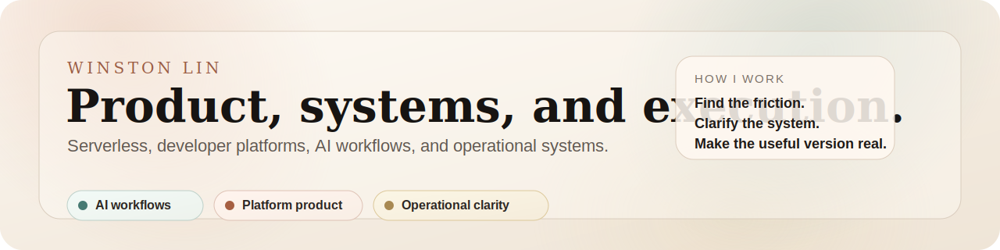

  

I work across serverless, platform products, AI workflows, operational tooling, and business systems.

Most of what I share here is technical, but the through-line is the same: find the friction, clarify the system, and ship the useful version.

Recent work leans heavily on OCI Functions and workflow tooling: onboarding simplification, migration readiness, async reliability, developer trust, and the practical side of how teams move from rough inputs to usable outputs.

The site is the cleanest path through the work. Case studies go deeper, writing stays lighter, and code shows the practical edge.

**Start here**

- [Case studies](https://winnielinnie.github.io/winstonlin-site/case-studies/) if you want the higher-context product and platform work
- [AI Work Needs Real Tools](https://winnielinnie.github.io/winstonlin-site/blog/what-working-with-codex-taught-me-about-ai-work/) if you want the clearest view of how I think about practical AI use
- [Portfolio site](https://winnielinnie.github.io/winstonlin-site/) if you want the full path across case studies, writing, and tools

**A few ways in**

- [Writing](https://winnielinnie.github.io/winstonlin-site/blog/) - product notes on friction, migration, AI workflows, and operating models
- [Codex note](https://winnielinnie.github.io/winstonlin-site/blog/what-working-with-codex-taught-me-about-ai-work/) - what hands-on AI work clarified for me about tools, review loops, and usable output
- [Incident timeline note](https://winnielinnie.github.io/winstonlin-site/blog/incident-timelines-need-a-stable-shape/), [repo onboarding note](https://winnielinnie.github.io/winstonlin-site/blog/public-repos-need-a-short-path-to-first-useful-success/), and [examples as interface](https://winnielinnie.github.io/winstonlin-site/blog/examples-are-the-interface-for-small-tools/) - shorter pieces on operational clarity and practical repo design
- [Oracle blogs](https://blogs.oracle.com/authors/winstonlin_1/) - public pieces on infrastructure and product work

**Selected work**

- [winstonlin-site](https://github.com/winnielinnie/winstonlin-site) - personal site with case studies, essays, and a cleaner record of recent work
- [oci-fn-object-storage-router](https://github.com/winnielinnie/oci-fn-object-storage-router) - reusable Python pattern for routing Object Storage events to downstream systems
- [repo-onramp-check](https://github.com/winnielinnie/repo-onramp-check) - Python CLI for checking whether a public repo has a usable first-run path
- [incident-timeline-formatter](https://github.com/winnielinnie/incident-timeline-formatter) - Python CLI for turning incident notes into a stable Markdown timeline
- [decision-journal-cli](https://github.com/winnielinnie/decision-journal-cli) - small CLI for making assumptions and revisit dates harder to lose
- [one-page-canvas](https://github.com/winnielinnie/one-page-canvas) - lightweight browser canvas for shaping one-page plans before they become heavier decks
- [doc-ship-check](https://github.com/winnielinnie/doc-ship-check) - last-mile docs cleanup script for publishable output

**What I tend to care about**

<table>
  <tr>
    <td valign="top" width="33%">
      <strong>AI workflows</strong> 
      Recovery paths, usable output, and systems that help people move from rough input to something shippable.
    </td>
    <td valign="top" width="33%">
      <strong>Platform product</strong> 
      Migration quality, first-run experience, reliability, and the friction that quietly decides adoption.
    </td>
    <td valign="top" width="33%">
      <strong>Business systems</strong> 
      Growth, service design, operating models, and the mechanics behind how teams actually deliver value.
    </td>
  </tr>
</table>

**Elsewhere**

- [LinkedIn](https://www.linkedin.com/in/winston-lins/)
- [Email](mailto:winstonl.96@gmail.com)
